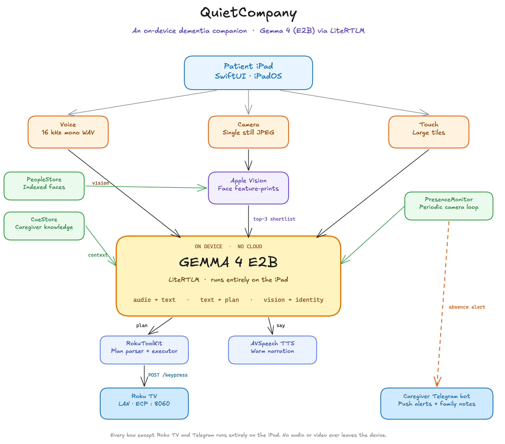
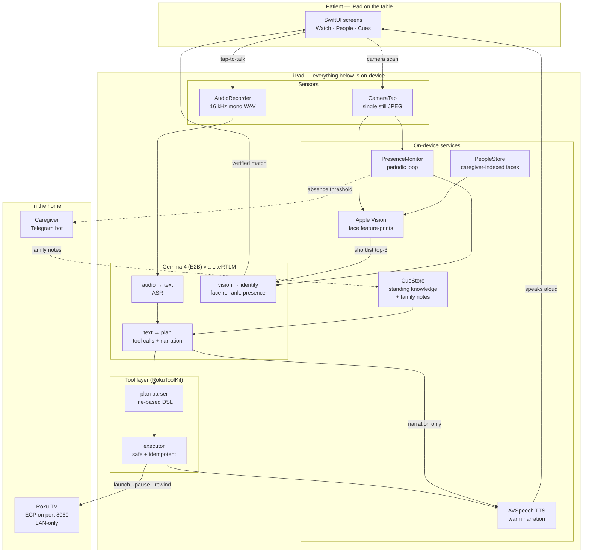

# QuiteCompany

**A calm, on-device companion iPad for people living with dementia.**

QuiteCompany helps a person with mild-to-moderate dementia do three small things on
their own that the disease quietly takes away: **watch the shows they love**,
**recognise the people who visit them**, and **answer the everyday questions** ("Did I
take my medicine?", "Where is Sarah?", "What day is it?") without having to ask a
caregiver every time.

Every model call runs **on-device with Gemma 4 (E2B) via LiteRTLM** — no cloud, no
audio leaving the iPad, no subscription. The device works the same in a care home
with no internet as it does on a kitchen table.

> Submission for the **Kaggle Gemma 4 Good** hackathon
> ([kaggle.com/competitions/gemma-4-good-hackathon](https://www.kaggle.com/competitions/gemma-4-good-hackathon)).



---

## Why this exists

We interviewed family caregivers and observed real patients. The pain points are
remarkably consistent — and almost none of them are solved by a "smarter assistant."
They're solved by **removing choice, hiding logistics, and using human language.**

| Pain point we heard                                                  | What QuiteCompany does                                          |
| -------------------------------------------------------------------- | --------------------------------------------------------------- |
| "He can't remember if Father Brown is on Hulu or BBC."               | Patient never sees a platform. One tile per show, ever.         |
| "She gets stuck inside a show and panics."                           | A plain "Stop watching" button. Always there. Same place.       |
| "He restarts the same episode three times — he thinks it's lost."    | Every tile says *Always here* and shows where you left off.     |
| "She can't tell which thing on screen is selected."                  | Outline + badge + scale + dim the rest. Redundant focus cues.   |
| "The remote says 'rewind 30 seconds'. That's not how she thinks."    | "Go back a little." "I missed that." Human time.                |
| "He asks 'who is this?' when our daughter walks in."                 | One photo, one name, one relationship. Plus shared memories.    |
| "I get a call at 2am: 'where are my pills?'"                         | Caregiver writes a Cue once. QuiteCompany answers in plain prose. |
| "I want to know if Dad's been sitting alone all afternoon."          | Periodic on-device presence check. Telegram ping if too long.   |

The brief that runs through the whole codebase: *bigger, fewer, clearer.* If a
feature helps a typical user but adds cognitive load for a dementia patient, it
doesn't ship.

---

## What's in the box

QuiteCompany is the **iPad app** ([`ios/Hearth`](ios/Hearth/)). There are three
screens, and they exist because they each solve one of the three things above.

### Watch — the show-centric TV remote

QuiteCompany talks to a Roku TV over the LAN (no cables, no account linking). The
patient sees their six favourite shows. They tap one — QuiteCompany launches it on
the TV, narrates "*Putting on Antiques Roadshow. You're twelve minutes in.*", and
stays as a friendly remote.

There is also a **tap-to-talk** button. The mic captures 16 kHz mono PCM, Gemma 4's
audio path transcribes it, and the *same* Gemma session plans the action through a
tiny tool-calling DSL
([RokuToolKit.swift](ios/Hearth/Hearth/Services/RokuToolKit.swift)). "Put on
Coronation Street" → `roku.launch("Coronation Street")` + a one-sentence spoken
reply. "Where is my daughter?" → consult the Cues catalog, answer in prose.

### People — face recognition with shared memory

Front camera takes one still. Apple Vision computes a face print and returns a
ranked shortlist of 3 candidates in ~10 ms. **Gemma 4's vision path** then re-ranks
pairwise — the cheap math narrows the field, the model decides identity. The result
card is deliberately minimal: portrait, name, relationship, where they're from, and
a strip of shared photos. **No bio paragraphs, no factoid stacks.**

### Cues — what Gemma knows about *this* person

The caregiver indexes "Cues" once: fuzzy keywords the patient might say + a short
note Gemma turns into a warm sentence. *"Where are my pills?" → "They're in the
blue box on the kitchen counter, next to the kettle."*

Cues are first-class in the prompt and override generic answers. Family members can
also send a **"note from Sarah"** through the caregiver's Telegram bot — those
become time-sensitive cues the patient can ask about in their own words.

### Wellness — the caregiver loop

While the iPad is on the table,
[PresenceMonitor.swift](ios/Hearth/Hearth/Services/PresenceMonitor.swift) samples
the front camera every few minutes and asks Gemma "is a person visible?". If the
answer has been *no* for longer than a threshold,
[CaregiverAlerter.swift](ios/Hearth/Hearth/Services/CaregiverAlerter.swift) pings
the caregiver on Telegram. Telegram, not SMS or email, because it's free, reliable,
cross-platform, and rings as a push notification.

---

## Architecture

Everything inside the iPad is local. The only network traffic is **LAN-only Roku
control** and **caregiver-initiated Telegram messages**. The Gemma model itself
runs on-device via LiteRTLM — no model API is called at runtime.

The PNG at the top of this README is the canonical architecture diagram. For a
text-readable fallback (useful in grep, screen-readers, or PR diffs), the same
graph is below in Mermaid:

<details>
<summary>Mermaid fallback (click to expand)</summary>


</details>

### How a typical "Put on Coronation Street" turn flows

1. Patient taps the big mic button on the Watch tab.
2. `AudioRecorder` captures 16 kHz mono PCM until release.
3. Gemma's **audio path** runs in a transcribe-only session (no routing, no
   character) → `"put on coronation street"`.
4. The transcript is fed into Gemma's **text path** with the full catalog: show
   list + Cues + family notes + current clock/weather + playback state.
5. Gemma returns a tiny plan in a line-based DSL —
   `roku.launch("Coronation Street")` plus a `say:` line for narration.
   (Line-based, not JSON, because small models follow simple grammars more
   reliably and there's no markdown-fence noise to strip.)
6. `RokuToolKit` parses and executes the plan against `RokuController`, which
   speaks ECP HTTP to the TV over the LAN.
7. `HearthTTS` reads the narration aloud while the TV starts the show.

The same plumbing answers *"where is my daughter?"* — only the parser sees no tool
calls and the narration comes from a matching cue ("*Sarah is at work today,
she'll be here at six.*").

### Why this split

| Decision                                  | Reason                                                                                       |
| ----------------------------------------- | -------------------------------------------------------------------------------------------- |
| Gemma 4 (E2B) via LiteRTLM, fully on-device | Patient audio never leaves the iPad. Works with no internet. Zero per-call cost.           |
| Vision shortlist → Gemma vision re-rank   | Vision is ~1 ms, Gemma vision is ~1–2 s. Use cheap math for narrowing, Gemma for deciding.   |
| Two-step audio: ASR, *then* text routing  | The audio model is great at ASR alone but defaults to greetings when also asked to route.    |
| Line-based DSL for tool calls             | Small models follow simple grammars more reliably than JSON.                                 |
| Roku over ECP on the LAN                  | No account linking, no cloud TV API, no per-platform OAuth. Works the day you plug it in.    |
| Telegram for caregiver loop               | Free, push-native, cross-platform, zero infra (~5 lines of HTTP).                            |

---

## Repository layout

```
ios/Hearth/                         iPad app — the canonical QuiteCompany
  LITERTLM_iOS_INTEGRATION.md       hard-won gotchas for embedding Gemma 4
                                    via LiteRTLM on iOS (read first if the
                                    app crashes at launch)
  Hearth/
    HearthApp.swift                 app entry, wires up Observable services
    RootView.swift                  top bar + screen switch + bottom nav
    Screens/
      TVScreen.swift                show-centric remote + voice control
      PersonScreen.swift            camera viewfinder + recognised person
      CuesScreen.swift              caregiver indexing of standing cues
    Services/
      HearthGemma.swift             Gemma 4 (E2B) via LiteRTLM — text · audio · vision
      RokuController.swift          ECP client (LAN HTTP on port 8060)
      RokuToolKit.swift             tool catalog + plan parser + executor
      FaceMatcher.swift             Vision feature-prints + Gemma re-rank
      PresenceMonitor.swift         periodic camera + presence check loop
      CaregiverAlerter.swift        Telegram bot send + inbox poll
      HearthTTS.swift               AVSpeechSynthesizer wrapper
      PeopleStore.swift             caregiver-indexed people + face prints
      AudioRecorder.swift           16 kHz mono WAV recorder
      CameraTap.swift               headless single-still camera
    Components/                     SwiftUI primitives + setup sheets
    Design/                         colour, type, theme palettes

src/                                React + Vite UI prototype (design source)
  App.jsx                           tablet shell, top bar, screen switch
  components/primitives.jsx         Icon, Button, ContextStrip, ShowTile…
  screens/
    HomeScreen.jsx                  Now card + relationship-based calling
    TVScreen.jsx                    show-centric remote prototype
    PersonScreen.jsx                identity card + shared photos
    RemindersScreen.jsx             day-at-a-glance reminders
  styles/                           design system + tablet + stage CSS

docs/                               submission assets (architecture PNG, screenshots)
reference/hearth-tablet-prototype.html   the original artifact — design truth
backend/roku_ecp_test.ipynb              Roku ECP exploration notebook
QuiteCompany-architecture.excalidraw     editable architecture diagram (Excalidraw)
```

> Internal Swift identifiers (`HearthGemma`, `HearthApp`, `HearthColor`, …) keep
> the codename **Hearth** that the project was built under. The shipped product
> brand is **QuiteCompany**.

---

## Run it locally

> **There is no APK or signed .ipa to download.** QuiteCompany is an iPadOS
> SwiftUI app and Apple's distribution rules require either a paid Apple Developer
> account (for TestFlight) or building from source. The fastest paths to seeing
> QuiteCompany in action are: (a) the **demo video** linked in the Kaggle
> writeup, or (b) the steps below.

### Prerequisites

| Component         | Required                                                              |
| ----------------- | --------------------------------------------------------------------- |
| **Mac**           | macOS 14 (Sonoma) or newer                                            |
| **Xcode**         | 16.0+ — install from the App Store                                    |
| **iPad**          | iPad with M-series chip (M1 or newer). Gemma 4 E2B needs the NPU.     |
| **Apple ID**      | Any free Apple ID for local "Personal Team" signing                   |
| **Node.js**       | 18+ — only for the React/Vite web prototype                           |
| **Roku TV**       | Any Roku model on the same Wi-Fi as the iPad (for Watch tab demo)     |
| **Telegram**      | A free Telegram account (for the caregiver alert demo)                |

### Step 1 — Clone the repo

```sh
git clone https://github.com/<your-org>/quitecompany.git
cd quitecompany
```

### Step 2 — Run the web prototype (no iPad needed)

The Vite app is the design-system source of truth and gives you a quick feel for
the dementia-first UI without any iPad or Roku.

```sh
npm install
npm run dev
```

Open the URL Vite prints (default `http://localhost:5173`). Click between the
Home / Watch / People / Reminders tabs in the bottom nav.

### Step 3 — Build the iPad app

> **Read [`ios/Hearth/LITERTLM_iOS_INTEGRATION.md`](ios/Hearth/LITERTLM_iOS_INTEGRATION.md) first** if you are setting this up on a fresh machine or hitting a launch-time crash. It covers four LiteRTLM-Swift integration traps that each fail silently with a misleading diagnostic — nested-dylib re-signing + script sandbox, the `increased-memory-limit` entitlement, the v0.11.0 binary swap inside DerivedData, and audio backend wiring. Together they account for the first few hours of pain when embedding Gemma 4 via LiteRTLM into a new iOS app.

```sh
open ios/Hearth/Hearth.xcodeproj
```

In Xcode:

1. Plug your iPad in over USB-C. Trust the Mac on the iPad if prompted.
2. **Signing & Capabilities** tab → set **Team** to your free Apple ID
   "Personal Team". Bundle identifier must be unique; change the suffix if Xcode
   complains.
3. Select your iPad as the run destination (top toolbar).
4. **Run** (⌘R). First build pulls the LiteRTLM Swift package — takes a minute.
5. On the iPad: **Settings → General → VPN & Device Management** → trust your
   developer certificate. Then launch QuiteCompany from the home screen.

### Step 4 — Download the Gemma 4 model (one-time)

Inside the running app:

1. Bottom nav → **Cues** tab → tap the "Companion" status card → **Gemma Setup**
   sheet opens.
2. Tap **Download companion**. The model is ~2.6 GB; do this on Wi-Fi.
3. Wait for "Companion is ready". The model is now cached on the iPad —
   subsequent launches are offline.

### Step 5 — Pair with a Roku TV (optional, for the Watch tab)

1. On the Roku TV: **Settings → Network → About** — note the IP address.
2. In QuiteCompany: **Cues** tab → **Roku setup** sheet → enter the IP, tap
   **Connect**. The app probes ECP on port 8060 and flips to ready.
3. Tap any show on the Watch tab — it launches on the TV.

### Step 6 — Wire up the caregiver Telegram (optional)

The header comment in
[`CaregiverAlerter.swift`](ios/Hearth/Hearth/Services/CaregiverAlerter.swift) has
the three-step Telegram bot setup. Paste the **bot token** and **chat id** into
the Telegram setup sheet, send a test message. Done.

### Troubleshooting

| Symptom                                | Fix                                                                                          |
| -------------------------------------- | -------------------------------------------------------------------------------------------- |
| Xcode: "code signature invalid" / dyld crash at launch | Nested-dylib re-sign isn't running (or the script sandbox is blocking it). See [`LITERTLM_iOS_INTEGRATION.md`](ios/Hearth/LITERTLM_iOS_INTEGRATION.md) §1. |
| Xcode: "no provisioning profile"       | Change the bundle identifier to something unique under your team.                            |
| App: `litert_lm_engine_create returned NULL` | DerivedData was cleaned and the v0.11.0 binary swap got reverted. See [`LITERTLM_iOS_INTEGRATION.md`](ios/Hearth/LITERTLM_iOS_INTEGRATION.md) §3. |
| App: "Gemma error — out of memory"     | Either the increased-memory entitlement is missing (see [`LITERTLM_iOS_INTEGRATION.md`](ios/Hearth/LITERTLM_iOS_INTEGRATION.md) §2) or the iPad is older than M1. Gemma 4 E2B needs the M-series NPU. |
| App: "Roku unreachable"                | iPad and Roku must be on the same Wi-Fi subnet. Disable AP isolation on the router.          |
| App: Telegram doesn't send             | Re-check bot token and chat id. Hit `/start` on the bot at least once from the caregiver side. |

---

## Privacy

- **Audio:** recorded → transcribed on-device → discarded. Never written to disk,
  never sent off-device.
- **Camera:** single stills only. The iOS green privacy indicator blinks every
  sample. Frames are passed to Gemma vision in-memory and dropped.
- **People index:** caregiver-indexed portraits and their face prints live in app
  storage on the iPad. No cloud sync.
- **Telegram:** the *only* outbound network path beyond the LAN, and it only
  sends caregiver-facing strings (presence alerts, family notes the caregiver
  wrote). No patient audio or imagery is ever transmitted.

---

## Citations & acknowledgements

### Model

- **Gemma 4 (E2B)** — Google DeepMind. On-device generative model running locally
  via LiteRT-LM. See the Gemma model card on Kaggle and the Gemma technical
  report for licence and intended-use details.
- **LiteRT-LM (formerly TensorFlow Lite for Generative AI)** — Google. The
  on-device runtime that loads and serves the Gemma weights inside the iPad app
  via the `LiteRTLMSwift` Swift package.

### Apple frameworks

- **Apple Vision** — `VNFeaturePrintObservation` and `VNGenerateImageFeaturePrintRequest`
  for face fingerprinting and shortlist retrieval.
- **AVFoundation** — `AVCaptureSession` (CameraTap), `AVAudioRecorder`
  (AudioRecorder), and `AVSpeechSynthesizer` (HearthTTS).
- **SwiftUI / Observation** — the entire UI layer and reactive state plumbing.

### Open-source assets

- **[Phosphor Icons](https://phosphoricons.com/)** — Helena Zhang & Tobias Fried.
  MIT licence. Used in the React/Vite web prototype.
- **[Atkinson Hyperlegible](https://brailleinstitute.org/freefont)** — Braille
  Institute of America. SIL Open Font Licence 1.1. Body sans typeface chosen for
  low-vision readability.
- **[Newsreader](https://fonts.google.com/specimen/Newsreader)** — Production
  Type. SIL Open Font Licence 1.1. Serif display typeface used for the calm,
  editorial tone of headers.

### Protocols & external services

- **Roku ECP (External Control Protocol)** — HTTP-over-LAN spec used to launch
  channels and send key events to the Roku TV.
- **Telegram Bot API** — outbound `sendMessage` + `getUpdates` polling used for
  the caregiver loop.

### Research & inspiration

The design brief and the patient pain-points table in this README were informed
by published guidance on dementia-friendly technology, family-caregiver
interviews, and direct observation. We are grateful to the caregivers who shared
their experience with us. Any errors of framing or design are ours.

### Licence

This project is released under the **MIT Licence** — see [LICENSE](LICENSE). Each
third-party dependency retains its own licence as cited above. The Gemma model
weights are governed by Google's Gemma Terms of Use, separate from this
repository's licence.

---

Built for the [Gemma 4 Good](https://www.kaggle.com/competitions/gemma-4-good-hackathon)
hackathon — a humanitarian application of small-model, on-device AI.
